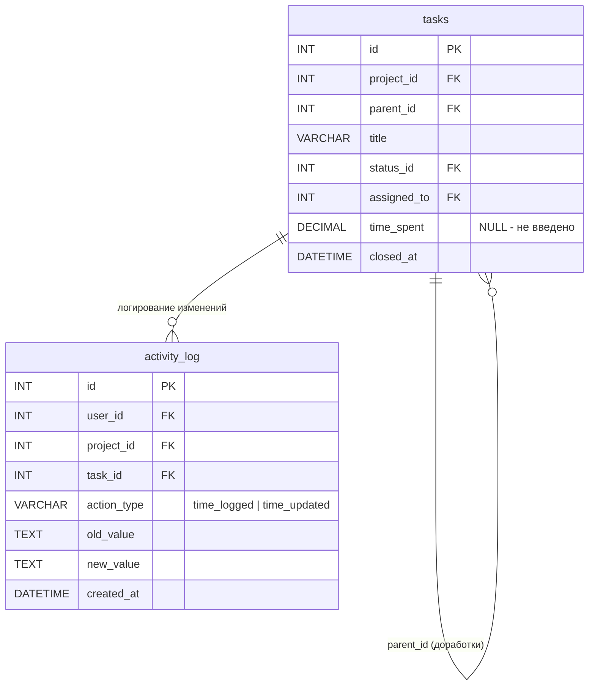

# Технический дизайн: Учёт времени (Time Tracking)

## Overview

Функциональность учёта времени добавляет возможность фиксации затраченного времени по задачам и подзадачам (доработкам). Исполнитель вводит время на вкладке «Информация» карточки задачи. Система хранит значение в отдельном поле таблицы `tasks`, контролирует доступ (только назначенный исполнитель), блокирует редактирование после закрытия задачи и логирует все изменения через `activity_log`.

Ключевые решения:
- Время хранится как `DECIMAL(6,1)` непосредственно в таблице `tasks` (поле `time_spent`) — простота, нет необходимости в отдельной таблице, так как на одну задачу приходится один исполнитель и одно значение времени.
- Валидация: шаг 0.5 часа, диапазон 0.5–999.5.
- Суммарное время по родительской задаче рассчитывается динамически (SUM по дочерним + собственное время).
- Все операции через AJAX для бесшовного UX.

## Architecture

```mermaid
flowchart TD
    subgraph Frontend ["Клиент (Vanilla JS)"]
        A[Вкладка Информация] -->|AJAX POST| B[/tasks/{id}/time]
    end

    subgraph Backend ["Сервер (PHP MVC)"]
        B --> C[TimeTrackingController]
        C --> D[TimeTrackingService]
        D --> E[Task Model]
        D --> F[ActivityLogService]
        E --> G[(MySQL: tasks.time_spent)]
        F --> H[(MySQL: activity_log)]
    end

    subgraph Access ["Контроль доступа"]
        C --> I[AuthMiddleware]
        C --> J[TaskAccessMiddleware]
        D --> K{Проверки}
        K -->|assigned_to == user_id| L[OK]
        K -->|status != closed| L
        K -->|parent не closed| L
    end
```

### Поток данных

1. Исполнитель открывает карточку задачи → фронтенд отображает текущее `time_spent` на вкладке «Информация».
2. Исполнитель вводит/изменяет значение и нажимает «Сохранить» → AJAX POST `/tasks/{id}/time`.
3. `TimeTrackingController` проверяет авторизацию, доступ к задаче.
4. `TimeTrackingService` выполняет бизнес-проверки (является ли назначенным, не закрыта ли задача/родитель) и валидацию значения.
5. При успехе — обновляет `tasks.time_spent`, записывает в `activity_log`.
6. Возвращает JSON с обновлённым значением и суммой по дереву.

## Components and Interfaces

### TimeTrackingController

```php
namespace Controllers;

class TimeTrackingController extends Controller
{
    /**
     * Сохранить/обновить затраченное время
     * POST /tasks/{id}/time
     * 
     * Принимает: { "time_spent": float }
     * Возвращает: JSON { "success": true, "time_spent": float, "total_time": float }
     */
    public function store(string $id): void;
}
```

### TimeTrackingService

```php
namespace Services;

class TimeTrackingService
{
    /**
     * Сохранить затраченное время для задачи
     *
     * @param int $taskId ID задачи
     * @param int $userId ID текущего пользователя
     * @param float $timeSpent Значение времени
     * @return array ['success' => bool, 'error' => string|null, 'time_spent' => float, 'total_time' => float]
     * @throws \InvalidArgumentException при ошибке валидации
     */
    public function saveTime(int $taskId, int $userId, float $timeSpent): array;

    /**
     * Валидация значения затраченного времени
     *
     * @param float $value Значение для проверки
     * @return array Массив ошибок (пустой если ОК)
     */
    public function validateTimeValue(float $value): array;

    /**
     * Проверка возможности редактирования времени
     *
     * @param array $task Данные задачи
     * @param int $userId ID текущего пользователя
     * @return array ['allowed' => bool, 'reason' => string|null]
     */
    public function canEditTime(array $task, int $userId): array;

    /**
     * Получить суммарное время по задаче и её подзадачам
     *
     * @param int $taskId ID задачи
     * @return float Суммарное время
     */
    public function getTotalTime(int $taskId): float;

    /**
     * Проверка: закрыта ли родительская задача
     *
     * @param int $taskId ID задачи
     * @return bool true если родитель закрыт
     */
    public function isParentClosed(int $taskId): bool;
}
```

### Расширение Task Model

В существующую модель `Task` добавляется поле `time_spent` в массив `$fillable`.

### API-эндпоинт

| Метод | URL | Описание |
|-------|-----|----------|
| POST | `/tasks/{id}/time` | Сохранить/обновить затраченное время |

Формат запроса:
```json
{
    "time_spent": 4.5
}
```

Формат успешного ответа:
```json
{
    "success": true,
    "time_spent": 4.5,
    "total_time": 12.0
}
```

Формат ответа при ошибке:
```json
{
    "error": "Описание ошибки",
    "code": 403
}
```

## Data Models

### Изменения в таблице `tasks`

```sql
ALTER TABLE `tasks` 
ADD COLUMN `time_spent` DECIMAL(6,1) NULL DEFAULT NULL 
AFTER `closed_at`;
```

Выбор `DECIMAL(6,1)`:
- Максимальное значение: 99999.9 (с запасом для 999.5 из требований)
- Точность: 1 знак после запятой (шаг 0.5)
- `NULL` по умолчанию — время ещё не введено (отображается как «—»)

### Записи в activity_log

| Поле | Значение при первом вводе | Значение при изменении |
|------|--------------------------|----------------------|
| `user_id` | ID исполнителя | ID исполнителя |
| `project_id` | ID проекта задачи | ID проекта задачи |
| `task_id` | ID задачи | ID задачи |
| `action_type` | `time_logged` | `time_updated` |
| `old_value` | `NULL` | Предыдущее значение (строка) |
| `new_value` | Введённое значение (строка) | Новое значение (строка) |

### Диаграмма данных




## Correctness Properties

*Свойство (property) — это характеристика или поведение, которое должно оставаться истинным при всех допустимых выполнениях системы. Свойства служат мостом между человекочитаемыми спецификациями и машинно-верифицируемыми гарантиями корректности.*

### Property 1: Валидация значения времени

*Для любого* числа `v`, функция `validateTimeValue(v)` принимает значение (возвращает пустой массив ошибок) тогда и только тогда, когда `v > 0`, `v <= 999.5` и `v` кратно `0.5`.

**Validates: Requirements 1.3, 1.4, 1.5**

### Property 2: Round-trip сохранения времени

*Для любого* валидного значения `time_spent` (0.5–999.5, шаг 0.5), если вызвать `saveTime(taskId, userId, time_spent)` для задачи, где `userId == assigned_to` и задача не закрыта, то последующее чтение `tasks.time_spent` для данной задачи вернёт то же самое значение.

**Validates: Requirements 1.2**

### Property 3: Контроль доступа к редактированию времени

*Для любой* задачи и любого пользователя, `canEditTime(task, userId)` возвращает `allowed = true` тогда и только тогда, когда выполняются ВСЕ условия: (1) `task.assigned_to == userId`, (2) статус задачи не `closed`, (3) родительская задача (если есть) не имеет статуса `closed`.

**Validates: Requirements 2.1, 2.2, 3.1, 3.2, 3.3, 3.4**

### Property 4: Суммарное время по дереву задач

*Для любого* дерева задач (родительская + N дочерних), `getTotalTime(parentId)` равно сумме `time_spent` родительской задачи и `time_spent` всех её прямых дочерних задач (с учётом NULL = 0).

**Validates: Requirements 4.2, 4.3**

### Property 5: Корректность записи в журнал действий

*Для любого* успешного вызова `saveTime(taskId, userId, newValue)`, в `activity_log` создаётся запись, где: `action_type` = `'time_logged'` если предыдущее значение было NULL, иначе `'time_updated'`; `old_value` = предыдущее значение (или NULL); `new_value` = строковое представление `newValue`; `user_id`, `project_id`, `task_id` соответствуют параметрам вызова.

**Validates: Requirements 5.1, 5.2, 5.3**

## Error Handling

### Ошибки валидации (HTTP 422)

| Ситуация | Сообщение |
|----------|-----------|
| Значение не кратно 0.5 | «Время должно быть кратно 0.5 часа» |
| Значение ≤ 0 | «Время должно быть положительным числом» |
| Значение > 999.5 | «Время не может превышать 999.5 часов» |
| Некорректный формат (не число) | «Введите корректное числовое значение» |

### Ошибки доступа (HTTP 403)

| Ситуация | Сообщение |
|----------|-----------|
| Пользователь не является исполнителем | «Только назначенный исполнитель может вносить время» |
| Задача закрыта | «Задача закрыта, редактирование времени недоступно» |
| Родительская задача закрыта | «Родительская задача закрыта, редактирование времени недоступно» |

### Ошибки системы

| Ситуация | Действие |
|----------|----------|
| Задача не найдена | HTTP 404, JSON `{"error": "Задача не найдена"}` |
| Ошибка БД | HTTP 500, JSON `{"error": "Внутренняя ошибка сервера"}`, логирование |
| Невалидный CSRF-токен | HTTP 403, стандартная обработка CsrfMiddleware |

## Testing Strategy

### Подход

Используется двойной подход к тестированию:
- **Unit-тесты** — проверка конкретных сценариев и краевых случаев
- **Property-based тесты** — проверка универсальных свойств на широком диапазоне входных данных

### Библиотека для PBT

Используется [PHPUnit](https://phpunit.de/) + [Eris](https://github.com/giorgiosironi/eris) — библиотека property-based testing для PHP.

### Property-based тесты

Каждый property-тест выполняется минимум 100 итераций и снабжён тегом:

```
// Feature: time-tracking, Property {N}: {описание}
```

| Property | Что тестируется | Генератор |
|----------|----------------|-----------|
| Property 1 | validateTimeValue | Случайные float: [-1000, 1500], с разным шагом |
| Property 2 | saveTime round-trip | Случайные валидные значения (0.5–999.5, кратные 0.5) |
| Property 3 | canEditTime | Случайные комбинации: task (status, assigned_to, parent_id), userId |
| Property 4 | getTotalTime | Случайные деревья: 1 родитель + 0..10 дочерних, time_spent ∈ [NULL, 0.5..100] |
| Property 5 | Записи activity_log | Случайные задачи с/без существующего time_spent + новое валидное значение |

### Unit-тесты

| Сценарий | Тип |
|----------|-----|
| Отображение поля для назначенного исполнителя | Example |
| Скрытие поля при assigned_to = NULL | Example |
| Отображение «—» при time_spent = NULL | Example |
| Отображение формата «X ч» | Example |
| Отображение записей time_logged/time_updated в истории | Example |
| Структура миграции — наличие поля time_spent | Smoke |

### Интеграционные тесты

| Сценарий | Что проверяется |
|----------|----------------|
| Полный цикл: авторизация → POST /tasks/{id}/time → проверка БД | Работа через HTTP |
| Проверка CSRF-защиты | CsrfMiddleware не пропускает без токена |
| Каскад: закрытие родительской задачи → блокировка дочерних | Бизнес-правило через API |
