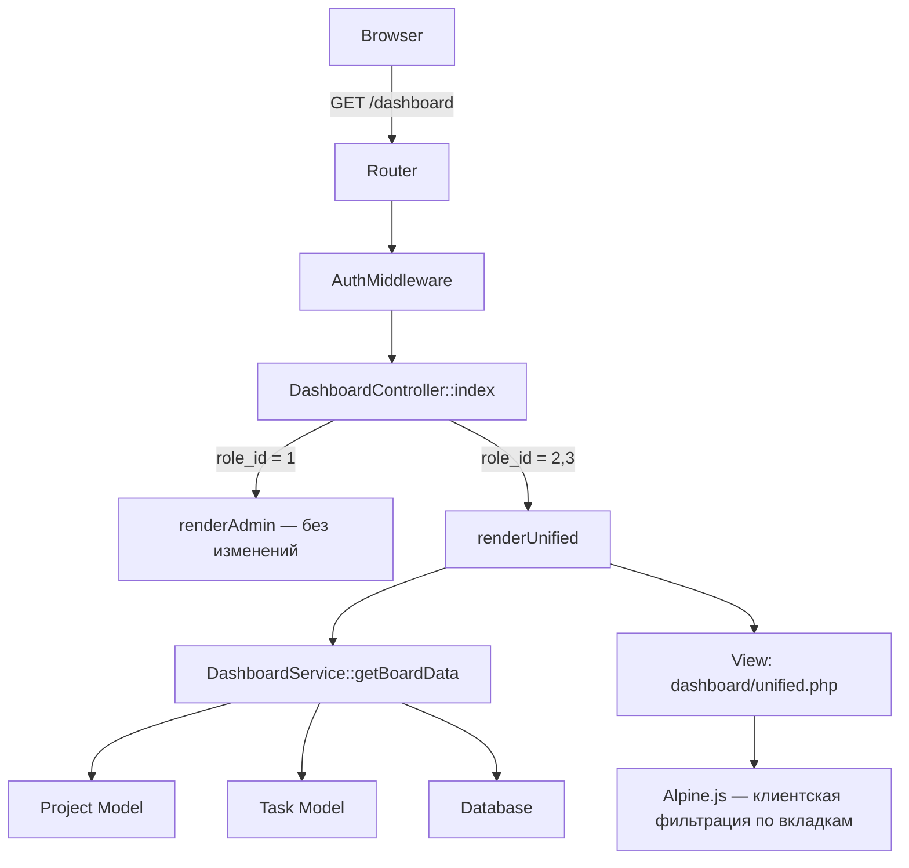

# Design Document: Unified Dashboard

## Overview

Единый дашборд заменяет текущие раздельные дашборды для ролей Manager и Executor единым интерфейсом с:
- **Вкладками проектов** (Project_Tabs) — горизонтальная навигация по проектам пользователя
- **Панелью статистики** (Stats_Panel) — три карточки с числом задач по статусам
- **Канбан-доской задач** (Task_Board) — три колонки: «В работе», «Доработки», «Готово»

Переключение между проектами происходит на клиенте (Alpine.js) без перезагрузки страницы. Все данные по всем проектам загружаются одним серверным запросом и фильтруются на клиенте через Alpine.js.

Дашборд Admin остаётся без изменений.

### Ключевые решения

| Решение | Обоснование |
|---------|-------------|
| Загрузка всех проектов одним запросом | У типичного пользователя 3–10 проектов × 20–50 задач — объём данных невелик, а UX без перезагрузки значительно лучше |
| Alpine.js для переключения вкладок | Уже используется в проекте, не требует дополнительных зависимостей |
| Фильтрация по роли на сервере | Безопасность: Executor не должен видеть чужие задачи даже в клиентском JSON |
| Единый view-шаблон `dashboard/unified.php` | Manager и Executor используют один шаблон; различие — только в данных |

## Architecture

### Компоненты системы



### Поток данных

1. Пользователь переходит на `/dashboard`
2. `AuthMiddleware` проверяет авторизацию
3. `DashboardController::index()` определяет `role_id`
4. Для `role_id = 2` (Manager) или `role_id = 3` (Executor) — вызывается `renderUnified()`
5. `DashboardService::getBoardData($userId, $roleId)` формирует структуру данных:
   - Список проектов пользователя
   - Задачи по каждому проекту (с фильтрацией по роли)
   - Группировка задач по статусам
6. Данные передаются в шаблон `dashboard/unified.php`
7. Alpine.js на клиенте управляет переключением вкладок и отображением

## Components and Interfaces

### 1. DashboardService (новый сервис)

**Файл:** `app/Services/DashboardService.php`

```php
<?php
namespace Services;

class DashboardService
{
    /**
     * Получить данные для единого дашборда
     *
     * @param int $userId ID текущего пользователя
     * @param int $roleId Роль пользователя (2 = Manager, 3 = Executor)
     * @return array Структура: ['projects' => [...], 'boardData' => [...]]
     */
    public function getBoardData(int $userId, int $roleId): array;

    /**
     * Получить задачи проекта для доски, сгруппированные по статусам
     *
     * @param int $projectId ID проекта
     * @param int $userId ID пользователя
     * @param int $roleId Роль (2 или 3)
     * @return array ['in_progress' => [...], 'revision' => [...], 'done' => [...], 'stats' => [...]]
     */
    public function getProjectBoardTasks(int $projectId, int $userId, int $roleId): array;

    /**
     * Группировка задач по статусу
     *
     * @param array $tasks Плоский массив задач
     * @return array ['in_progress' => [...], 'revision' => [...], 'done' => [...]]
     */
    public function groupTasksByStatus(array $tasks): array;

    /**
     * Фильтрация задач по роли пользователя
     *
     * @param array $tasks Массив задач
     * @param int $userId ID пользователя
     * @param int $roleId Роль (2 = все задачи, 3 = только assigned_to = userId)
     * @return array Отфильтрованный массив задач
     */
    public function filterTasksByRole(array $tasks, int $userId, int $roleId): array;
}
```

### 2. DashboardController (расширение)

**Файл:** `app/Controllers/DashboardController.php`

Изменения:
- Метод `renderManager()` и `renderExecutor()` заменяются единым `renderUnified()`
- Метод `renderAdmin()` остаётся без изменений

```php
/**
 * Единый дашборд для Manager и Executor
 */
private function renderUnified(array $user): void
{
    $userId = (int) $user['id'];
    $roleId = (int) $user['role_id'];

    $dashboardService = new \Services\DashboardService();
    $data = $dashboardService->getBoardData($userId, $roleId);

    $this->view('dashboard/unified', [
        'title'     => 'Дашборд — Traking',
        'projects'  => $data['projects'],
        'boardData' => $data['boardData'],
        'roleId'    => $roleId,
    ]);
}
```

### 3. View-шаблон: `dashboard/unified.php`

**Файл:** `views/dashboard/unified.php`

Структура шаблона:

```
┌─────────────────────────────────────────────────────────┐
│  Project_Tabs: [Проект A] [Проект B] [Проект C] ...     │
├─────────────────────────────────────────────────────────┤
│  Stats_Panel:                                           │
│  ┌──────────────┐ ┌──────────────┐ ┌──────────────┐    │
│  │ В работе: 5  │ │ Доработки: 2 │ │ Готово: 8    │    │
│  └──────────────┘ └──────────────┘ └──────────────┘    │
├─────────────────────────────────────────────────────────┤
│  Task_Board:                                            │
│  ┌────────────┐ ┌────────────┐ ┌────────────┐          │
│  │ В работе   │ │ Доработки  │ │ Готово     │          │
│  │ ─────────  │ │ ─────────  │ │ ─────────  │          │
│  │ [Card 1]   │ │ [Card 3]   │ │ [Card 5]   │          │
│  │ [Card 2]   │ │ [Card 4]   │ │ [Card 6]   │          │
│  │            │ │            │ │ [Card 7]   │          │
│  └────────────┘ └────────────┘ └────────────┘          │
└─────────────────────────────────────────────────────────┘
```

### 4. Alpine.js компонент (в шаблоне)

```javascript
// Данные передаются из PHP через JSON
Alpine.data('dashboard', () => ({
    projects: <?= json_encode($projects) ?>,
    boardData: <?= json_encode($boardData) ?>,
    activeProjectId: null,

    init() {
        // Первый проект активен по умолчанию
        if (this.projects.length > 0) {
            this.activeProjectId = this.projects[0].id;
        }
    },

    get currentBoard() {
        return this.boardData[this.activeProjectId] || { in_progress: [], revision: [], done: [] };
    },

    get currentStats() {
        const board = this.currentBoard;
        return {
            in_progress: board.in_progress.length,
            revision: board.revision.length,
            done: board.done.length,
        };
    },

    selectProject(projectId) {
        this.activeProjectId = projectId;
    }
}));
```

## Data Models

### Входная структура данных (PHP → View)

```php
// $projects — массив проектов пользователя
[
    ['id' => 1, 'title' => 'Проект A', 'status_name' => 'Активный'],
    ['id' => 2, 'title' => 'Проект B', 'status_name' => 'Активный'],
]

// $boardData — задачи по проектам, сгруппированные по статусам
[
    1 => [  // project_id
        'in_progress' => [
            ['id' => 10, 'title' => 'Задача 1', 'priority' => 'high', 'deadline' => '2025-02-01', 'assigned_name' => 'Иванов'],
            ...
        ],
        'revision' => [...],
        'done' => [...],
    ],
    2 => [...],
]
```

### Task_Card — поля для отображения

| Поле | Источник | Описание |
|------|----------|----------|
| `id` | `tasks.id` | Для формирования ссылки `/tasks/{id}` |
| `title` | `tasks.title` | Заголовок задачи |
| `priority` | `tasks.priority` | `low` / `medium` / `high` / `urgent` |
| `deadline` | `tasks.deadline` | Дата дедлайна (может быть `null`) |
| `assigned_name` | `users.name` (JOIN) | Имя исполнителя |
| `status_code` | `task_statuses.code` | Код статуса для группировки |

### SQL-запрос для задач доски

```sql
SELECT t.id, t.title, t.priority, t.deadline, t.assigned_to,
       ts.code AS status_code, ts.name AS status_name,
       u.name AS assigned_name
FROM tasks t
JOIN task_statuses ts ON t.status_id = ts.id
LEFT JOIN users u ON t.assigned_to = u.id
WHERE t.project_id = :projectId
  AND ts.code IN ('in_progress', 'revision', 'done')
  -- Для Executor добавляется: AND t.assigned_to = :userId
ORDER BY t.priority DESC, t.deadline ASC
```

### Существующие таблицы (без изменений схемы)

Данная фича **не требует миграций БД**. Используются существующие таблицы:
- `projects` — проекты
- `project_users` — связь пользователей с проектами
- `tasks` — задачи
- `task_statuses` — статусы задач (содержит `in_progress`, `revision`, `done`, `closed`)
- `users` — пользователи (для `assigned_name`)

## Correctness Properties

*Свойство (property) — это характеристика или поведение, которое должно оставаться истинным при всех допустимых выполнениях системы. Свойства служат мостом между человеко-читаемыми спецификациями и машинно-проверяемыми гарантиями корректности.*

### Property 1: Корректность выборки проектов пользователя

*Для любого* пользователя и любого набора записей в таблице `project_users`, метод получения проектов для дашборда должен вернуть ровно те проекты, где `user_id` совпадает с ID текущего пользователя, и не вернуть ни одного проекта, где пользователь не является участником.

**Validates: Requirements 1.1**

### Property 2: Корректность группировки задач по статусам

*Для любого* набора задач с различными статусами, функция группировки должна поместить каждую задачу со статусом `in_progress` в колонку «В работе», каждую задачу со статусом `revision` в колонку «Доработки», каждую задачу со статусом `done` в колонку «Готово», и исключить все задачи с другими статусами (включая `closed`).

**Validates: Requirements 3.1, 3.6**

### Property 3: Ролевая фильтрация задач

*Для любого* набора задач проекта и любого пользователя: если роль пользователя — Manager (`role_id = 2`), функция фильтрации должна вернуть все задачи без исключения; если роль — Executor (`role_id = 3`), функция должна вернуть только задачи, где `assigned_to` равно ID этого пользователя.

**Validates: Requirements 4.1, 5.1, 5.2**

### Property 4: Полнота данных карточки задачи

*Для любой* задачи с непустым заголовком, установленным приоритетом и назначенным исполнителем, отрендеренная карточка (Task_Card) должна содержать: заголовок задачи, индикатор приоритета, имя исполнителя, а также дедлайн если он установлен.

**Validates: Requirements 3.4, 4.2**

## Error Handling

### Серверные ошибки

| Сценарий | Обработка |
|----------|-----------|
| Пользователь не авторизован | `AuthMiddleware` → редирект на `/login` |
| Роль не определена (`role_id = 0`) | Редирект на `/login` (существующее поведение) |
| Ошибка БД при выборке проектов | Логирование ошибки, показ пустого дашборда с сообщением |
| У пользователя нет проектов | Показ сообщения «Нет проектов» вместо доски |

### Клиентские ошибки (Alpine.js)

| Сценарий | Обработка |
|----------|-----------|
| `boardData` для проекта пуст | Показ пустых колонок без ошибок |
| Некорректный `activeProjectId` | Fallback на первый проект в списке |
| JSON-данные повреждены | Alpine.js graceful degradation — пустое состояние |

### Граничные случаи

- **Проект без задач** — показываются три пустые колонки со статус-заголовками
- **Задача без исполнителя** (`assigned_to = NULL`) — для Manager: показывается «Не назначен»; для Executor: задача не попадает в выборку (корректное поведение)
- **Задача без дедлайна** — поле дедлайна не отображается на карточке

## Testing Strategy

### Юнит-тесты (пример-ориентированные)

| Тест | Что проверяет |
|------|---------------|
| `DashboardService::getBoardData` с Manager | Возвращает все задачи всех проектов |
| `DashboardService::getBoardData` с Executor | Возвращает только назначенные задачи |
| `DashboardService::getBoardData` без проектов | Возвращает пустой массив |
| `DashboardController::index` с Admin role | Рендерит `dashboard/admin` |
| `DashboardController::index` с Manager role | Рендерит `dashboard/unified` |
| Rendering `unified.php` с пустыми проектами | Содержит «Нет проектов» |

### Property-based тесты (PHPUnit + пользовательские генераторы)

Библиотека: **PHPUnit** с пользовательскими генераторами случайных данных (нативный PHP, без внешних PBT-библиотек, т.к. проект без Composer).

Каждый property-тест выполняется минимум **100 итераций** со случайными входными данными.

| Свойство | Тег |
|----------|-----|
| Property 1: Выборка проектов | `Feature: unified-dashboard, Property 1: Для любого пользователя возвращаются ровно его проекты` |
| Property 2: Группировка по статусам | `Feature: unified-dashboard, Property 2: Для любого набора задач группировка корректна` |
| Property 3: Ролевая фильтрация | `Feature: unified-dashboard, Property 3: Manager видит все, Executor только свои` |
| Property 4: Полнота карточки | `Feature: unified-dashboard, Property 4: Карточка содержит все обязательные поля` |

### Ручное / E2E тестирование

- Переключение вкладок (Alpine.js реактивность)
- Адаптивная вёрстка (viewport < 768px)
- Горизонтальный скролл вкладок на мобильных
- Визуальное соответствие цветовой индикации Stats_Panel
